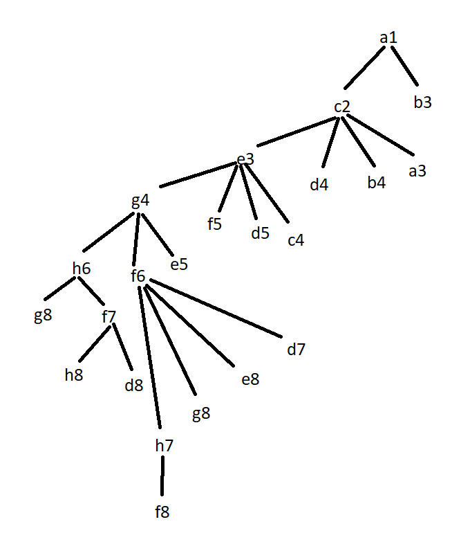

**1.**

**a)**

**b)** Todas

**c)**

As heuristicas admissiveis sao h3 e h5, pois sao as unicas que nao sobrestimam o custo da soluçao. A melhor será h3, uma vez que se aproxima mais do valor real

**d)**

insert tree here :)

**2.**

**a)**

Individuo: 10bits representam as cores  dos 5 paises

00 - azul, 01 - verde, 10 - branco

Individuo = 1001100001

**b)**

numErradas = nº de fronteiras erradas (ou seja, quando dois paises adjacentes a esta fronteira têm a mesma cor)

Convertendo num problema de maximização:

função de adaptação: 7 - numero de fronteiras erradas

(7 é o numero de fronteiras existentes)

f(1) = 7-2 = 5

f(2) = 7-1 = 6

f(3) = 7-3 = 4

f(4) = 7-5 = 2

f(5) = 7-2 = 5

**c)**

total = 5+6+4+2+5 = 22

p(1) = 5/22 = 0.227 -> [0, 0.227]

p(2) = 6/22 = 0.272 -> ]0.227, 0.499]

p(3) = 4/22 = 0.1818 -> ]0.499, 0.6808]

p(4) = 2/22 = 0.0909 -> ]0.6808, 0.7717]

p(5) = 5/22 = 0.227 -> ]0.7717,1]

Por seleção elitista passa i2

Resultado da seleção: i2 i4 i2 i1 i5

**d)** 

i2 mantem 

i4 mantem

i2 cruza -> 0001010010

i1 cruza -> 1001100001

i5 mantem 

Crossover:

i2i1: 0001010001

i1i2: 1001100010

Mutação: 

2ª geração:

i2, i4, i2i1, i1i2, i5

**3.** (Machine Learning)

**4.**

**a)** 

**b)** Um sucessor que é melhor avaliado que o estado atual é sempre aceite. No entanto, mesmo quando não é melhor avaliado, pode ser aceite com uma dada probabilidade. Esta probabilidade depende tanto da temperatura atual como da diferença de valores entre o estado atual e esse estado, sendo calculada com a funçao exp(delta/T), em que delta é a diferença e T a temperatura.

**d)** Os cortes alfa-beta o que fazem é retirar dos nós a visitar aqueles que nao vao mudar o resultado atual do pai, ou seja, ja nao vale a pena examina-los porque não muda nada. Por exemplo, se um nó que quer o min tem um filho que tem o valor 0, sendo que não há nenhuma avaliação menor que 0, qualquer que seja o valor do outro filho nunca vai ser menor que 0.

