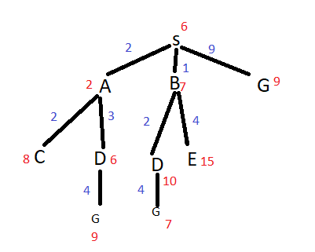

**1.**

**a)** S->G

**b)** 

S nao é final por isso visitamos e obtemos: A(2), B(1), G(9).

O menor custo é B e este nao é final por isso visitamos e obtemos: D(3), E(5).

O menor custo é A por isso visitamos e obtemos: D(5), C(4).

O menor custo é D por isso visitamos e obtemos: G(7).

Os primeiros 4 nós a serem visitados com a pesquisa de custo uniforme sao: S, B, A, D.

**c)** 

Solução encontrada: S -> B -> D -> G

**d)** É admissivel porque nunca sobrestima o custo da solução.
Não é consistente porque nao se verifica em diversos casos, h(N) <= c(N,a,N') + h(N')
Ex:

h(S) = 6 > 2+h(A)

h(B) = 6 > 2+h(D)

**2.**

**a)**

**3.**

**a)** A funçao avaliação seria a soma da distancia entre cidades adjacentes na solução. A função vizinhança seria trocar a ordem com que ele visita 2 cidades aleatorias.

evaluate(initial) = 30 + 35 + 20 + 35 = 120

**b)**

A-B-C-D-A

Ti = 50

T(n) = 50 - 10*n 

Atenção: nós queremos minimizar o custo

4 estados:

* A-C-B-D-A  evaluate = 40+35+25+35 = 135 aumentou, e(15/40) > 0.82 --> 1.45>0.82, é aceite

* A-C-D-B-A evaluate = 40+20+25+30 = 115, melhora por isso aceita
 
* A-B-D-C-A evaluate = 30+25+20+40 = 115, é igual

* A-D-C-B-A evaluate = 35+20+35+30 = 110, melhora por isso aceita

**c)** O objetivo do algoritmo é fugir do otimo local, se não houver aleatoriedade dificilmente se chega a soluçoes mais diferentes que podem estar mais proximas da soluçao otima.

**4.**

**a)**

Não necessita de incluir o seu conhecimento do jogo em uma função de avaliação. Esta resulta da 
razão entre o número de jogos aleatórios efectuados a partir da posição considerada e que resultaram 
em vitória e o número total de jogos tentados. 
Interrompido em qualquer momento a aplicação do algoritmo, consegue dar o movimento mais 
promissor encontrado até aí pois resulta de jogos completos anteriormente realizados. É generalizável 
a qualquer jogo com adversários porque não depende do conhecimento sobre o jogo para além da sua 
mecânica.

**b)** Ou se escolhe sempre o estado próximo com menor valor estimado do custo para a solução (caso do 
algoritmo “Hill climbing”) ou, caso em que o próximo estado considerado tenha um maior custo para 
chegar à solução, a sua aceitação depende de uma probabilidade considerada para esse efeito (caso 
do “Simulated Annealing”). Nos AGs, por ex., também se geram estados seguintes dependentes de 
alguma aleatoriedade 

**c)** Serve como uma normalização, tornando o cálculo do Ganho não tendencioso em virtude de
existirem atributos com muitos valores possíveis e outros com poucos. Essa assimetria resultaria
numa sobrevalorização dos atributos com muitos valores possíveis. Ao dividir pela informação de
separação normaliza-se o Ganho

**d)** raiz = 5; nó pai <=5; e os filhos <=5

**e)**

A função de combinação aplica-se aos valores entrados em cada nó da rede e pode ser a sua soma
ou o seu máximo, mínimo, etc, afetada pelos pesos dessas ligações à entrada. A função de
transferência reage ao valor obtido das entradas pela função de combinação para obter um
resultado que transforme esse valor de acordo, normalmente com uma função mais discriminante
do tipo sigmóide (ou tipo “step” …) sendo assim a saída

**f)**

Aprendizagem realizada sobre um “histórico” em que os exemplos já incluem a sua classificação.
Conhecemos assim todas as classes possíveis que podemos atribuir a exemplos futuros. Na
aprendizagem não supervisionada não são conhecidas apriori as classes possíveis pois os exemplos
passados, mesmo no caso de existirem, não estão classificados 

**g)** nao sai