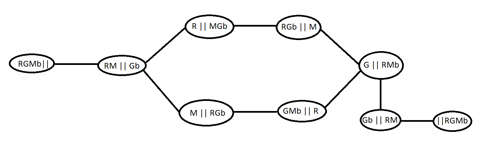
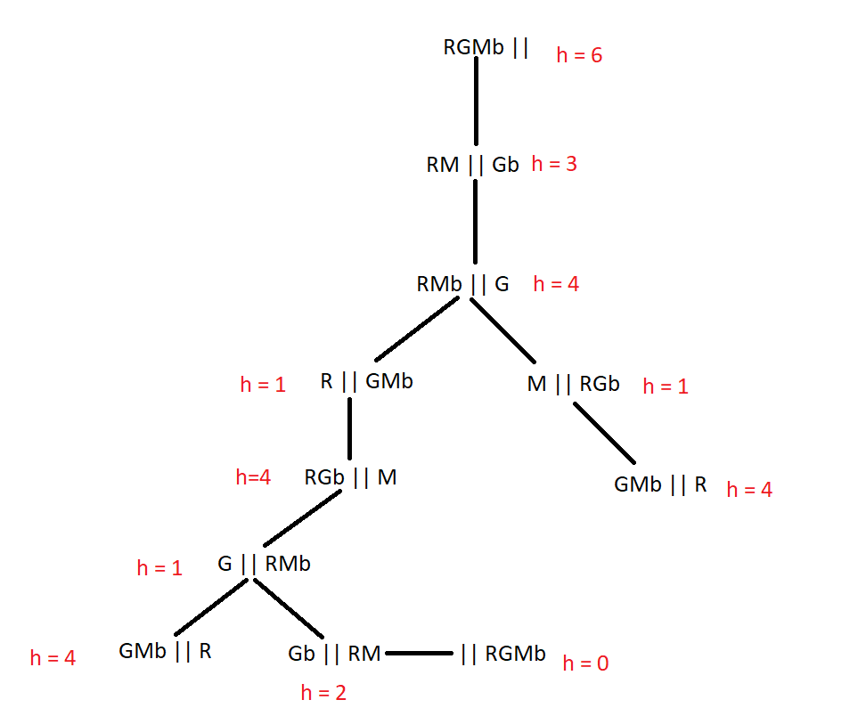

**1.**
* uma raposa, uma galinha, uma cesta de milho
* um barco que so pode transportar um deles
* raposa nao pode ficar com a galinha, nem a galinha com o milho

**a)**

**b)**

Uma função heuristica admissivel seria:

h = 2n, se o barco estiver na margem da esquerda

h = 2n - 1, se o barco estiver na margem da direita

Em que n é o numero de coisas que estao na margem inicial. Para transferir cada coisa é necessário trazer o barco e ir com a coisa. O custo será maior se for necessário trazer de volta um dos objetos.

h(RGMb||) = 6   h(RM||Gb) = 3  h(||RGMb) = 0

**c)**

**2.**

**a)** C(S1) = max(10 + 7 +8 , 11 + 12) = 25

**b)** 

*  S2 = {A-M2, B-M1, C-M2, D-M2, E-M1}
    - C(S2) = max(7+8, 10+11+12) = 33

*  S3 = {A-M1, B-M3, C-M2, D-M2, E-M1}
    - C(S3) = max(10+8, 11+12, 7) = 23

*  S4 = {A-M1, B-M1, C-M3, D-M2, E-M1}
    - C(S4) = max(10+7+8, 12,11) = 25

*  S5 = {A-M1, B-M1, C-M2, D-M3, E-M1}
    - C(S5) = max(10+7+8, 11,12) = 25

*  S6 = {A-M1, B-M1, C-M2, D-M2, E-M2}
    - C(S6) = max(10+7, 11+12+8) = 31

*  S7 = {A-M1, B-M1, C-M2, D-M2, E-M3}
    - C(S7) = max(10+7, 11+12, 8) = 23

A variante "steepest accent" gera todos os sucessores e escolhe aquele que é melhor avaliado. Neste contexto, melhor avaliado é o que tem menor custo, por isso o sucessor escolhido poderiam ser tanto o 3 como o 7.

**c)**

p(S2) = e^(25-33/10)= 0.449
 S2 é rejeitado pois 0.55 > 0.449

S3 é aceite pois 23 < 25.

Pelo algoritmo de arrefecimento simulado o sucessor de S1 adotado seria o S3.

**3.** (machine learning)

**a)**
**b)**
**c)**
**d)**

**4.**

**a)** O algoritmo de pesquisa em profundidade com profundidade limitada, sendo este limite a profundidade máxima, um vez que assim permite obter uma solução a uma profundidade inferior ao limite dado, mesmo que esta nao seja otima. Tem tambem poucos requisitos de memoria o que tambem é importante dado o grande fator de ramificaçao do problema.

**b)** h' = h / 1.1 = 0.909 * h 

**c)**

**d)**

Total = 10+15+27+30 = 82

p(C1) = 10/82 = 0.122

p(C2) = 15/82 = 0.183

p(C3) = 27/82 = 0.329

p(C4) = 30/82 = 0.366

**e)** Nós 9, 1, 2, 7

**f)** Regras de causais, uma vez que o agente conhece todo o ambiente, daí sabendo quais as causas de cada perceçao que tem do mesmo.

**g)**