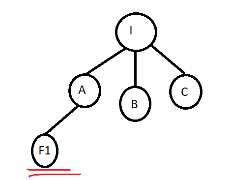
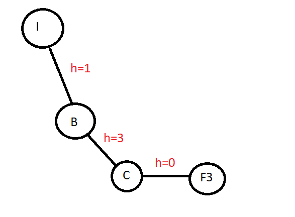

**1.**

**a)**

**i.** F1

**ii.**  F3

**iii.**  F3

**b)**

Sim, uma vez que o valor da heuristica é inferior ao custo real da solução em todos os nós da arvore.

**c)** 

BFS é otimo se todos os passos possiveis tiverem o mesmo custo, pois expande sempre o nó menos profundo ainda nao explorado.

O greedy nao é otimo, nem sempre encontra a solução otima.

O algoritmo A* é otimo.

**2.**
