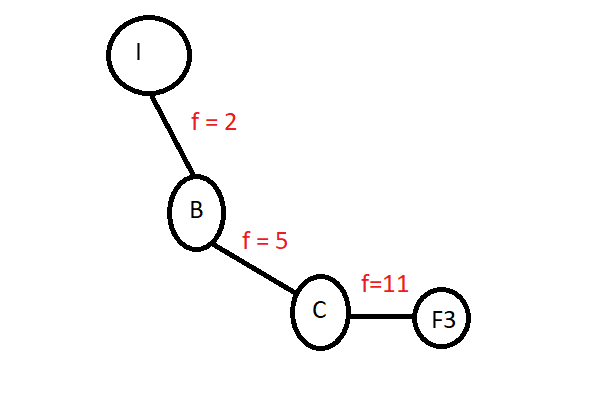

**1.**

**a)**

**i.** F1

**ii.**  F3

**iii.**  F3

**b)**

Sim, uma vez que o valor da heuristica é inferior ao custo real da solução em todos os nós da arvore.

**c)** 

BFS é otimo se todos os passos possiveis tiverem o mesmo custo, pois expande sempre o nó menos profundo ainda nao explorado.

O greedy nao é otimo, nem sempre encontra a solução otima.

O algoritmo A* é otimo.

**2.**

**a)**

A representaçao do individuo pode ser uma lista de tamanho 5 sendo que cada indice corresponde à zona com esse numero e o seu valor é um dos 3 carateres representantes das diferentes árvores(C, P, E).

individuo i: [E, P, E, C, E]

**b)**

Função adaptação: 700 - soma dos custos de plantação em cada zona - penalização
Penalização = 100*n_iguais (n_iguais é o nº de zonas adjacentes com a mesma espécie plantada)
O objetivo é minimizar o custo, transformamos um problema de minimização em maximização,
subtraindo pelo valor de custo máximo (700 = 70hectares *10)

**c)**

**d)**

**3.** 
**a)**

Entropy(S) = -4/8log2(4/8) - 4/8log2(4/8) = 1

**b)**

SplitInfo(Forma) = -5/8log2(5/8) -3/8log2(3/8) = 0.954
GainSplit(Forma) = 1 - 0.951 = 0.048
GainRatio(Forma) = 0.048 /0.954 = 0.051

SplitInfo(Cor) = -6/8log(6/8) -2/8log(2/8) = 0.811
GainSplit(Cor) = 1 - 0.688 = 0.311 
GainRatio(Cor) =  0.311 / 0.811 = 0.383

SplitInfo(NOlhos) = -2/8log2(2/8) - 2/8log2(2/8) -4/8log2(4/8) = 1.5
GainSplit(NOlhos) = 1 - 0.655 = 0.344
GainRatio(NOlhos) = 0.344/1.5 = 0.23

Escolhe-se a cor.

**c)**

**d)**

Se cor=verde, então Marciano=sim: 

    2 erros em 6 -> (e+1)/(n+2) = 3/8 = 0.375

Se cor=vermelho, entao Marciano=nao:
    0 erros em 2 -> (e+1)/(n+2) = 1/4 = 0.25

**4.**

**a)** Nao, bfs visista sempre primeiro todos os nós do nivel e so depois passa para o nivel seguinte, enquanto iterative deeepening estabelece um limite de profundidade e explora cada nó até essa profundidade e so depois passa para o nó seguinte no mesmo nivel, logo nao é verdade que encontram sempre a mesma solução.

**b)** O simulated annealing pode escolher como estado seguinte um estado sucessor que tem uma avaliação inferior ao estado atual, de acordo com uma probabilidade que descrece ao longo do tempo. No inicio, a probabilidade de escolher este tipo de sucessores é mais elevada.

**c)** 7, 4, 8, 4

**d)**

Nao sai

**e)**

Nao sai 

**f)**

Nao sai 

**g)**