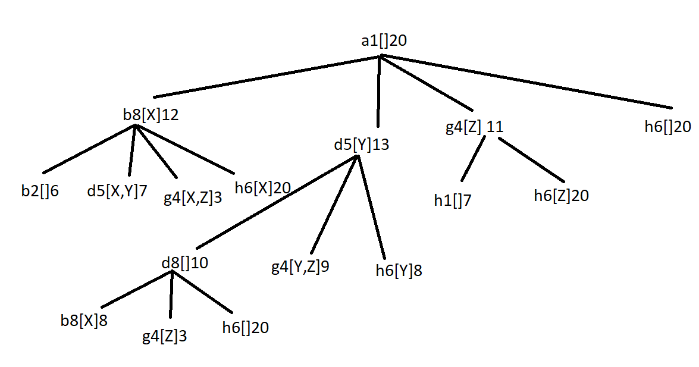

**1**

**a)**

ordem de expansao: a1[]20, d5[Y]13, b8[X]12, g4[Z]11, h6[]20

**b)**

* h1: admissivel, porque no minimo cada objeto vai ter que se deslocar uma celula para atingir a posição final (subestima na maior parte dos casos)

* h2: admissivel, porque no minimo cada objeto vai ter que se deslocar uma celula para atingir  a posiçao final, mesmo que ja esteja no robo

* h3: nao admissivel, pois para entregar dois objetos pode ter parte do caminho em comum e assim o custo de cada um dos objetos teria essa parte comum, sobrestimando o custo total da soluçao

* h4: admissivel, iguala o custo real quando so 1 dos objetos está por colocar na sua posiçao final

**c)**
 A heuristica 4, pois as primeiras duas na maior parte dos casos subestimam o custo e esta obtém valores mais proximos dos reais.

 **2.**

 **a)**

 Lista de 5 elementos em que cada indice contem o numero da maquina alocada para aquela peça, ex1:[1,3,2,3,3]

 **b)**

 A funçao adaptação é custo da maquina com maior duraçao

 f(i) = max(M1,M2) = (10+7+8, 11+12) = 25

 f(ii) = max(M1, M2, M3) = (10, 11, 7+12+8) = 27

 f(iii) = max(M1, M2) = (10+7, 11+12+8) = 31

 f(iv) = max(M1, M2) = (7, 10+11+12+8) = 41

 **c)**

 Total = 25 + 27 + 31 + 41 = 124

    p(i) = 25/124 =  0.202 [0; 0.202]

    p(ii) = 27/124 = 0.2177 ]0.202; 0.420]

    p(iii) = 31/124 = 0.25 ]0.420;0.670]

    p(iv) = 41/124 = 0.330 ]0.670; 1]

Seleciona i, ii, ii, iv

 **d)**

 i mantem

 ii cruza

 ii mantem 

 iv cruza

 cruza ii/iv = 

 **3.**

 **a)**

 **b)**

 **4.**

 **a)** Uma heuristica admissivel é aquela que nunca sobrestima o custo de chegar à soluçao. Uma heuristica consistente é uma que garante que em cada nó o custo estimado nunca é superior ao custo estimado a partir de um nó sucessor n' mais o custo do passo de n para n': h(n) <= c(n, a, n') + h(n').
 Sim uma heuristica admissivel nao é necessariamente consistente.

 **b)**

 **c)** delta = 12-15 = -3 p = e ^(-3/0.8) = 0.0235

 **d)** O MCTS tem a vantagem de não requerer uma função de avaliação, bastando aplicar a mecânica do jogo até aos estados finais. Permite reduzir muito o fator de ramificação, concentrando a pesquisa nos nós mais promissores. Tem também um mecanismo natural que permite balancear “exploration” e “exploitation”. Uma desvantagem do MCTS é que converge para o Minimax mas muito devagar

 **e)** 

 **f)** Regras de diagnostico, uma vez que parte de efeitos observados em direçao às causas desses efeitos.

 **g)**