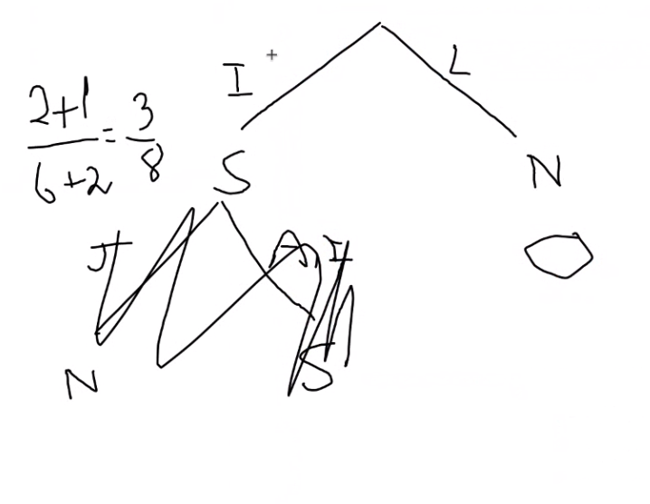

**1. Pesquisa**

**1.1**

Representação: pode ser representado pela posiçao atual [x,y]

Estado inicial: [1,2]

Estado final: [3,4]

Teste objetivo: se ja chegou à posiçao (3,4)

Operadores:

* left: move-se para a esquerda
    -pre-condiçoes: coordenada x nao pode ser 1

* right: move-se para a direita
    - pre-condiçoes: coordenada x nao pode ser 3

* up: move-se para cima
    -pre-condiçoes: coordenada y nao pode ser 1

* down: move-se para baixo
    - pre-condiçoes: coordenada y nao pode ser 3

Função custo: numero de movimentos para ir da posiçao inicial para a objetivo 

**1.2**

**i)** 

D

(a partir de D) A E F

(a partir de A) B

(a partir de E) G

(a partir de F) H

(a partir de B) C

(a partir de G) I

(a partir de H) 

(a partir de C)

(a partir de I) J

Caminho: D-E-G-I-J

**ii**

D

(a partir de D) A E F
(a partir de A) B
(a partir de B) C
(a partir de C)
(a partir de E) G
(a partir de G) I
(a partir de I) J

Caminh: D-E-G-I-J

**1.3**

**iii.**

D

(a partir de D) A E F

(a partir de E) B G

(a partir de B) C

(a partir de C)

(a partir de G) I

(a partir de I) J

**iv**

D

(a partir de D) A E F

(a partir de E) B G

(a partir de B) C

(a partir de C)

(a partir de G) I

(a partir de I) J

**v**

D

(a partir de D) A E F

(a partir de E) B G 

(a partir de G) I

(a partir de I) J

**vi**

D

(a partir de D) A E F

(a partir de E) B G 

(a partir de G) I

(a partir de I) J

**1.4** BFS ???

**1.5** 4^10 = ???

**2.Aprendizagem**

**2.1** -4/8log2(4/8) - 4/8 log(4/8) = 1

**2.2** 

SI(localidade) = -6/8log2(6/8)- 2/8log2(2/8) = 0.811
GR(localidade) = (1-0.688)/0.811 = 0.385

SI(sexo) = -4/8log2(4/8)- 4/8log2(4/8) = 1
GR(sexo) = (1-0.951)/1 = 0.049 

SI(idade) = -2/8log2(6/8)- 2/8log2(2/8) -4/8log2(4/8) = 1.5
GR(idade) = (1-0.6551.5)/1.5 = 0.230

R:localidade

**2.3** 

**2.4** 

**2.5** 

Evita o overfitting
 

**3. Inteligência Aritifical**

**3.1**

Depth 1: 1

Depth 2: 1 2

Depth 3: 1 2 3

Depth 4: 1 2 3 1 4

**3.2** A heurisitica C. Se são ambas admissiveis nenhuma vai sobrestimar o custo da solução, portanto, o maximo delas nunca vai sobrestimar o custo da solução e será o valor mais proximo do real, uma vez que a metade da soma ia ser um valor mais baixo do que o real e mesmo o minimo tambem porque, mais uma vez, nenhuma delas está a sobrestimar. Portanto o resultado obtido seria sempre menor ou igual que o valor real, e uma heuristica é tanto melhor quanto mais proxima do valor real.

**3.3** 

**3.4** O simulated annealing pode escolher como estado seguinte um estado sucessor que tem uma avaliação inferior ao estado atual, de acordo com uma probabilidade que descrece ao longo do tempo. No inicio, a probabilidade de escolher este tipo de sucessores é mais elevada.

**3.5**

**3.6** A = 13; B = 1; C = 13; D <= 8; M e N 

**3.7**

Bastava passar o nó C para o lugar do B assim apenas o primeiro de B ia ser visitado e o primeiro de D. Sendo que F,G,M,N nao seriam visitados.

**3.8** 

E x: x come tudo se tudo diferente de X

Vx: x é baleia => x é mamifero

Ex: x come todos os peixes

**3.9** Nao sai

**3.10** 

It is used to categorize unlabeled data.

Given a set of training examples, each marked as belonging to one of two categories, an SVM training algorithm builds a model that assigns new examples to one category or the other, making it a non-probabilistic binary linear classifier. SVM maps training examples to points in space so as to maximise the width of the gap between the two categories. New examples are then mapped into that same space and predicted to belong to a category based on which side of the gap they fall.