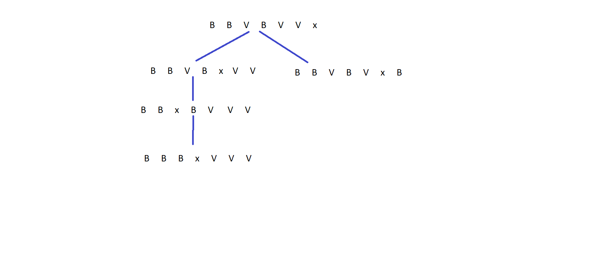
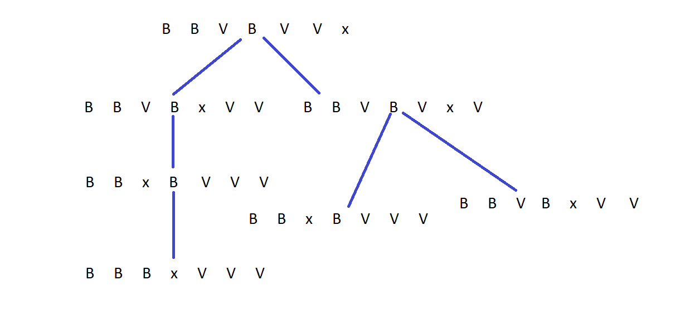
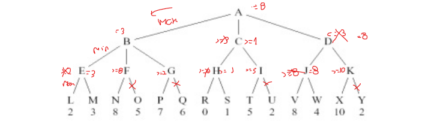

**1. Pesquisa de soluções**

**1.1**

Representação: o problema pode ser representado por um array com 7 entradas em que o indice corresponde à posiçao da peça no tabuleiro, em que x representa a célula vazia, B uma peça branca e V uma peça vermelha.

Estado inicial: [V, V, V, x, B, B, B]

Teste objetivo: [B, B, B, x, V, V, V]

Operadores:

* m1V: 
    - pré-condições: a peça ao qual é aplicado é vermelha, a casa à direita está vazia e o indice da peça tem que ser menor que 7
    - efeitos: o indice i passa a ter o valor x e o indice i +  1 o valor V, custo de 1 na solução final 

* m1B: 
    - pré-condições: a peça ao qual é aplicado é branca, a casa à esquerda está vazia e o indice da peça tem que ser maior que 0
    - efeitos: o indice i passa a ter o valor x - 1 e o indice i - 1 o valor B, custo de 1 na solução final 

* m2V:
    - pré-condições: a peça ao qual é aplicado é vermelha e a casa i+2 está vazia e i deve ser menor que 6
    - efeitos: o indice i passa a ter valor x e o indice i+2 passa a ter o valor V, custo de 2 na soluçao final

* m2B:
    - pré-condições: a peça ao qual é aplicado é branca e a casa i-2 está vazia e i deve ser maior que 1
    - efeitos: o indice i passa a ter valor x e o indice i-2 passa a ter o valor B, custo de 2 na solução final

* m3V:
    - pré-condições: a peça ao qual é aplicado é vermelha, a casa de i + 3 está vazia e i é menor que 5
    - efeitos: o indice i passa a ter valor x e o indice i+3 passa a ter o valor V, custo de 2 na soluçao final

* m3B:
    -pré-condições: a peça ao qual é aplicado é branca, a casa de i-3 está vazia e i é maior que 2
    - efeitos: o indice i passa a ter valor x e o indice i-3 passa a ter o valor B, custo de 2 na solução final.

função de custo: (queremos minimizar) valor igual à soma do custo de todos os movimentos efetuados para chegar ao estado objetivo

if(operand == m1V or operand == m1B) cost += 1
else cost += 2

**1.2**

**a)** h1 = 0 é sempre admissivel, pois nunca sobrestima o valor da solução ótima

**b)** h2 = 5 não é admissível. Exemplo: [B, B, B, V, x, V, V], em que apenas resta uma troca com custo 1 para atingir o objetivo, o valor 5 sobrestima o custo do caminho ótimo a partir desse estado ( 5 não é menor ou igual a 1)

**c)** h3 = soma do numero de Bs nas celulas 5,6,7 com o numero de Vs nas celulas 1, 2 e 3, é admissivel, pois nunca vai sobrestimar o custo da soluçao otima. No limite da posiçao inicial a heuristica tem valor 6, inferior aocusto da soluçao otima a partir do estado inicial (sao necessarios mais do que 6 movimentos). No limite de uma posiçao final, como [B, B, B, V, x, V, V] ou [B, B, B, V, V, V, x] tambem nao sobrestima, pois a heuristica tem para ambos estes casos valor 0 e o custo para p ptimo é, respetivamente 1 e 3.


**1.3**

O custo de efetuar um qualquer movimento nunca ultrapassa a distancia absoluta que percore ao efetuar esse movimento. Por isso a distância à casa objetivo mais proxima nunca vai sobrestimar o custo da soluçao otima.

Para as peças vermelhas a distância à casa objetivo mais proxima é 4 - i e para as brancas i-2.

```py
def heuristic(state):
    h = 0
    for i in range 7:
        if state[i] == V: h += max(0, 4-i)
        elif state[i] == B : h += max(0, i - 2)
    return h
```

**1.4**






**2. Optimização**

**2.1**

Representaçao do problema: tanto os clientes como as fabricas sao caracterizados pela sua posição (x,y)

Representação da soluçao: lista ordenada de tamanho 6 com os clientes visitados, assumindo sempre que parte da fabrica 1 e termina na fabrica 2.

custo: distancia euclidiana entre os dois pontos (pretende-se minimizar)

função avaliação: 
```py
def evaluate(state):
    cost = 0
    for i in range(1, clientesVisitados.size()):
        if i == 1:
            cost += dist(fab1, clientesVisitados[i])
        elif i == clientesVisitados.size():
            cost += dist(clientesVisitados[i], fab2)
        else :
            cost += dist(clientesVisitados[i], clientesVisitados[i+1])
    return cost

```

**2.2**

Uma função de vizinhança simples seria trocar 2 elementos aleatorios da lista solução

```py
def neighbour(sol):
    a = random(0, len(sol))
    b = a
    while(b == a):
        b = random (0, len(sol))

    copyclients = sol
    copyclients[a] = sol[b]
    copyclients[b] = sol[a]

    return copyclients
```

**2.3**

Hill-climbing classico
```py

def hill_climbing():
    n = 0
    state = []
    for i in range(0, 6):
        randomNum = []
        while True:
            randomNum = round(random()*5)
            if state.includes(randomNum):
                continue
            state.push(randomNum)
            break

    while True:
        if n == 100: break

        new_state = neighbour(state)
        if evaluate(new_state) < evaluate(state)-
            state = new_state
        else:
            n += 1
```


**2.4**


* Problema 1: [5,3,2,4,1,6], custo 12.727922061357859

* Problema 2: [1,3,5,2,6,4], custo 22.132560768607995

* Problema 3: [3,1,5,6,2,4], custo 18.886349517372675


**3. Inteligência Artificial**

**3.1**

Sim, porque o espaço de estados é reduzido, sendo uma forma rapida de resolver o problema.

A implementação consistiria em guardar numa estrutura de dados a melhor jogada a partir do estado atual, sendo este consituido pelas posiçoes das peças no tabuleiro e a identifcação do jogador a quem pertencem (X ou O).

**3.2**

O algoritmo de pesquisa uniforme é completo e garante solução otima, o A* é um algoritmo completo e garante a solução otima se a heuristica utilizada for admissivel. Como todas as soluções têm custos diferentes, so existe uma soluçao otima, sendo que ambos os algoritmos conseguem encontrar esta mesma solução como ja foi referido.


**3.3**

Assumindo que o ultimo nó expandido foi o B

a) C.

b) E.

c) D. (pesquisa primeiro os nós com menor valor g)

d) C. (pesquisa primeiro os nós com menor heuristica)

e) G. (pesquisa primeiro menor valor de f = g + h)


**3.4**

Quanto melhor for a ordenação dos nós gerados, mais cortes pode fazer o alfa-beta.

No pior dos casos vai-se ter que visitar b^d nós (sem b o branching factor e d depth). Se a ordenação do nós tiver otima apenas se precisa de visitar b^(d/2), cerca de metade da profundidade.
Se for aleatorio pode ser menor que o pior caso.


**3.5**



a) A = 8 ; B  = 3 ; C <= 1 ; D = 8 ; 

b) O, Q, U, Y

**3.6**

delta = 18 - 20 = -2

T = 0.9

a) como é um caso em que não há melhoramento e queremos maximizar, é aceite com uma probabilidade de  p = e^(delta/T) = e^(-2/0.9) = 10.84%

b) como, tendo em conta que se quer minimizar, é um melhoramento, é apenas aceite.

**3.7**

**3.8**

**3.9**

**3.10**