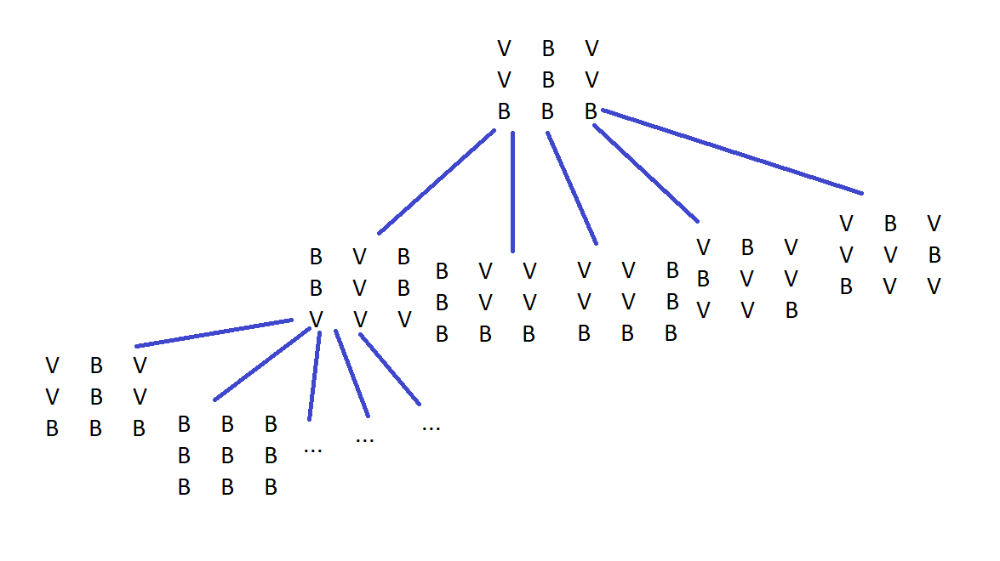
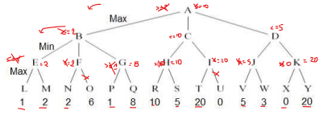

**1. Pesquisa de soluções**

**1.1)**
    Modo de representação: matriz 3x3, em que  0 é branco e 1 é vermelho
    [
        [X,X,X]
        [X,X,X]
        [X,X,X]
    ]
    Estado inicial: [[1,0,1],[1,0,1],[0,0,0]]
    Teste objetivo: [[0,0,0],[0,0,0],[0,0,0]]
    Operadores:
        * Não há pre-condiçoes para os operadores
        * ALL: inverter todo o tabuleiro
        * TL: inverter o quadrado do topo esquerdo
        * TR: inverter o quadrado do topo direito
        * BL: inverter o quadrado de baixo esquerdo
        * BR: inverter o quadrado de baixo direito
    Função de custo: numero de peças invertidas
        if(operand == (TL | TR | BL | BR)) cost = 4
        else if(operand == ALL ) cost = 9
    
 **1.2)** Cada estado tem 5 ramificaçoes, pois há 5 operadores possiveis (todos sem pre-condiçoes), por isso a ramificaçao media é de 5. 
 Cada elemento pode ter dois valores (0 ou 1) e a matriz tem 9 elementos, por isso a dimensao do espaço de estados(numero de estados possiveis para o problmea) será 2^9 = 512.

**1.3)**

 

BFS: expande primeiro todos os nós do nivel 1 e só depois é que passa para o nível 2 e encontra a solução

DFS: expande o primeiro nó até ao fim, encontrando a solução no nível 2 (o limite de profundidade neste caso nao afetou)


**1.4)** h(n) = numero de peças vermelhas no tabuleiro

É admissivel porque nunca se sobrestima o custo para chegar à solução, uma vez que pelo as peças vermelhas que estao no tabuleiro têm que ser invertidas
```py
def h(state):
    count = 0
    for line in state:
        for cell in line:
            if cell == 1:
                count += 1
    return count
```
**2.Optimização**

* 2 brigadas com rotas diariamente geradas~
* Tempo da rota tem que ser no máximo 8h (inclui viagem+tempo de inspeçao)
* n estabelecimentos
* 2 rotas que maximizem o numero de estabelecimentos inspecionados
* Simplificação: 1h de inspeçao, tempo de deslocação de um ponto ao outro é 1/20 da distancia de Manhattan entre esses pontos.


**2.1)**
ficheiros de input
```
10 %numero de estabalecimentos
4 3 % x y
5 8
...
```

ficheiros de output
```
[[1,2,3],[4,5,6], []] %estabelecimentos ordenados em cada rota de visitas mas uma lista dos nao visitados
```

**2.2)**
A restrição forte é o tempo disponivel (8h). O criterio de otimizaçao é o numero de locais inspecionados.
A solução é avaliada pelo numero de locais que é inspecionado.

Penalizam-se as soluções que excedam o tempo
```py
def evaluate(sol):
    counter = 0
    time = 0

    for i in range(0,2):
        for location in range(1, len(sol[i])):
            counter += 1 
            time += manhattan_dist(sol[i][location-1], sol[i][location]) + 1
    
    return 0 if time > 8 else time + cont
```

**2.3)**

Rota 1: I->A->B->C->I

Distancia = 20 + 20 + 10 + 10 + 10 + 10 = 80

Tempo = Distancia / 20 = 80/20 = 4

Tempo de inspeção = 1 * 3 = 3h

Tempo total = 4 + 3 = 7h


Rota 2: I -> D -> C -> I

Distancia = 10 + 20 + 10 + 10 + 20 + 10 = 80

Tempo = 4 h

Tempo de inspeçao = 1 * 2 = 2h

Tempo total = 2 + 4 = 6h

A solução é viavel pois o tempo total de cada brigada nao excede 8h e é otima pois visita todos os estabelecimentos.

**2.4)**

A função vizinha poderia ser:

Escolher um numero aleatorio entre 0 e 2, para escolher se vamos remover um elemento, adicionar um elemento ou trocar um elemento entre brigadas.

remover: escolher uma brigada aleatoria e um elemento aleatorio da brigada a remocer, apagar esse elemento e adiciona-lo na lista de nao visititados

adicionar: escolher um elemento aleatorio da lista de nao visitados, apagar o elemento, escolher uma brigada a adicionar e uma posiçao aleatorio para o colocar e coloca-lo na posiçao escolhida

trocar: escolher um elemento aleatorio de cada brigada e troca-los

Ex:
Sol = [ABC, DE, []]
2.1 --> [BC, DE, A], [AC, DE, B], [AB, DE, C], [ABC, E, D], [ABC, D, E]

2.3 --> [DBC, AE, []], [EBC, DA, []],...


**9.**
P = Performance : aterragem segura, não brusca, confortável para os passageiros

E = Environment: via aérea (passaros, outros avioes) e pista de aterragem (pessoal, veiculos, outros avioes)

A = Actuators: mecanismos de controlo do aviao, controlo do rol e pitch, controlo da potencia dos motores, controlo da aterrisagem, etc.

S = Sensors: sensor de altura, inclinaçao, pressao, velocimetro, GPS, etc.

O ambiente é dinâmico, inacessível, não deterministico e continuo.

O mundo real é bastante complexo para um agente reativo simples, especialmente quando envolve uma tarefa
complexa e crítica (vida dos passageiros) que não pode ser resolvida simplesmente com ligação direta entre o valor
dos sensores para as ações. Por isso não é possível usar um agente reativo simples.


**10.**

**10 a)** 



A = 10; B = 2; C = 10; D <= 5


**10 b)** 

Os nós O, U, X e Y.


**11.**

A afirmação é verdadeira. O algoritmo minimax com alfa-beta cuts e com profundidade limitada pode ser utilizado para jogos complexos. Como o algoritmo analisa as jogadas possiveis, primeiro em profundidade, encontra uma primeira soluçao muito rapida (ao chegar à profundidade limite). Para retomar uma soluçao ao fim de um tempo limite basta interromper a pesquisa e verificar qual a melhor soluçao ate esse momento retornando-a. Esta soluçao rápida será imperfeita o que pode ser melhorado com uma boa ordenaçao dos nós na expansao (colocando primeiro as jogadas mais prometedoras).


**12.**
```py
init = initial_solution()

for i in range(1, 1501):
    T = 0 if i > 1000 else T = 1.0 - i/1000
    n = randomNeighbour(init)
    delta = evaluate(n) - evaluate(init)
    init = n if(dif <0 or (random(0,1) < e^(delta/T)) else init = init
```


**13.**

Não! O ambiente do mundo de Wumpus não é totalmente acessível e precisa de ser explorado. É preciso que o
agente se lembre de estados anteriores, onde é que o "stench" e "breeze" estiveram, etc. Por isso, um agente reativo simples, embora, com sorte possa resolver algumas instâncias do problema, não pode com segurança resolver o
mundo do wumpus. 

**14.**

1NN: 1 vizinho mais próxima

14: C  15: B 16: A


3NN: 3 vizinhos mais próximos   

14: B 15: B  16: A  


**15.**
**16.**

Pr = e^(5/0.5)/ (e^(5/0.5)*2 + e^(1/0.5) + e^(6/0.5)) = 0.11

**17.**

P = count("de",c) + 1 / (count("de",c)+size_vocabulary) =  (5 + 1)/ (27+31) = 0.1

