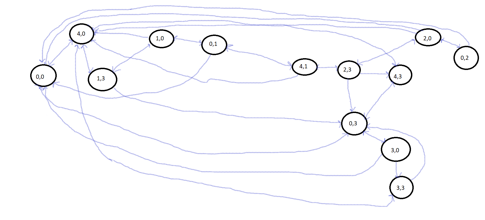

*a) Formulate this problem as a search problem by defining the state representation, initial state,operators (their name, preconditions, effects, and cost), and objective test*

**State Representation**

This problem representation can be a tuple with two variables: a and b, representing the amount of water in each bucket, respectively. Each state is defined as (a,b), where 0 <= a <= 4 and 0<= b <= 3.

**Initial State**

Both buckets are empty at the start, so the initial state is represented as (0,0).

**Operators**

In this problem all operators have the same cost, it can be 1.

We can only: fill completely a bucket, empty a bucket and pour one bucket into the other until either the second one is full or the first one is empty. Therefore, the operators of this problem are:

| Operator                                                     | Initial State and Preconditions | Final State  |
| ------------------------------------------------------------ | ------------------------------- | ------------ |
| Fill the 4L bucket                                        | (x, y) with x < 4               | (4, y)       |
| Fill the 3L bucket                                        | (x, y) with y < 3               | (x, 3)       |
| Empty the 4L bucket                                       | (x, y) with x > 0               | (0, y)       |
| Empty the 3L bucket                                       | (x, y) with y > 0               | (x, 0)       | 
| Pour water from the 3L bucket to completely fill the 4L bucket | (x, y) with x + y >= 4 and y > 0  | (4, y - (4 - x)) |
| Pour water from the 4L bucket to completely fill the 3L bucket | (x, y) with x + y >= 3 and x > 0  | (x - (3 - y), 3) |
| Pour all the water from the 3L bucket to the 4L bucket    | (x, y) with x + y <= 4 and y >= 0 | (x + y, 0)     | 
| Pour all the water from the 4L bucket to the 3L bucket    | (x, y) with x + y <= 3 and x >= 0 | (0, x + y)     |

**Objective Test**

The aim is to determine which operations to carry out so
that the first bucket contains n liters, which means we want to reach the states like (n, b), where, for instance, n = 2.

*b) Solve the problem, by hand, using tree search.*

